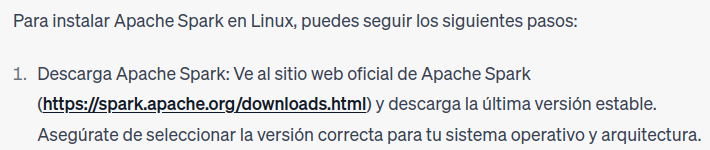

# Lab 3

# ¿Cómo se instala Spark en una computadora personal?

En mi caso, para poder instalar Spark en Linux lo que hice fue preguntarle a Chat GPT. Los pasos que me dio me fueron útiles y fueron los siguientes:

1. Descargar la librería de Apache Spark de la página web oficial.
    
    
    
2. Extraer la carpeta descargada y moverla a la ruta `/opt/spark`
    
    
    
    El directorio opt es una carpeta que se utiliza como convención para guardar software externo al sistema operativo.
    
3. Finalmente, configuré las variables de entorno como Chat GPT me instruyó:


Luego de esto, yo decidí seguir trabajando con VS Code, por lo que tuve que agregar las librerías de Spark a mi proyecto. Esto lo hice yendo a las configuración de mi proyecto en Java, y agregando los .jar incluidos en la carpeta jars del tar descargado de la página oficial de Apache Spark, a las Referenced Libraries.


Esto me permitió usar las clases y métodos definidos de Spark en mi código.

# ¿Qué estructura tiene un programa en Spark?

La siguiente información la saqué del Internet en general.

Spark es un framework que se usa para para poder procesar y distribuir tareas en un cluster de máquinas utilizando lenguajes como Scala, Java, Python, R, entre otros.

Particularmente, Spark utiliza lo que se llaman **contextos** que proporcionan la conexión y la interfaz entre nuestra aplicación y el cluster de máquinas conectadas. En este contexto es donde estableceremos la conexión con el cluster y procederemos a realizar las tareas deseadas. Es un contexto por aplicación.

Para realizar una tarea entre varias máquinas, cargaremos los datos que queremos manipular. Spark, dentro de su contexto, tiene métodos para poder leer y cargar datos de archivos o de distintas fuentes. Estos datos se cargan en abstracciones llamadas **RDD** que sirven para poder particionar el conjunto de datos y repartir esas particiones entre las distintas máquinas del cluster, para que cada máquina trabaje con un pedacito de la información.

Una vez tenemos nuestros objetos **RDD**, podemos realizarles o bien **transformaciones** o **acciones**. Las transformaciones son cambios que se le realizan a los datos cargados, creando a su vez otro conjunto de datos. Ejemplos de transformaciones son métodos como filter, map, reduce, etc. Las acciones nos sirven para poder obtener los resultados generados luego de transformar nuestros datos.


Para todo contexto de Spark generador también debemos cerrarlo, esto lo hacemos con el método **close**.

# ¿Qué estructura tiene un programa de conteo de palabras en diferentes documentos en Spark?

Independientemente del tipo de documento, el conteo de palabras en Spark se realiza de una forma similar. Primero que nada, como se mencionó anteriormente, necesitamos crear un contexto de Spark. En este contexto luego cargaremos un archivo de texto que puede ser de una variedad de tipos, el método textFile se encarga de extraer las lineas del documento en un RDD. A este RDD lo podremos manipular utilizando las transformaciones que provee Spark: a cada palabra la *mapearemos* en otro tipo de objeto RDD del tipo clave-valor, y luego veremos cada instancia de cada palabra y sumaremos aquellas que se repitan, sumando sus valores. Esto último lo haremos con la transformación **reduce**.

Entonces, en una estructura debemos tener

1. Configuración y creación del contexto Spark
2. Objeto RDD que contiene el texto del documento que se quiere leer
3. Transformaciones necesarias para extraer las palabras del texto cargado y contar las instancias de cada una, guardando la palabra junto con la cantidad de veces que aparece en un par del tipo clave-valor.
4. Acciones para obtener los resultados en un archivo aparte o para mostrarlos por pantalla.

```java
public class Main {
    public static void main(String[] args) {
        // Configuramos el SparkContext con nombre de la App y 
				// la red donde esta el "cluster" de máquinas
        SparkConf conf = new SparkConf().setAppName("WordCount").setMaster("local");
				// Creamos el contexto con la configuración previa
        JavaSparkContext sc = new JavaSparkContext(conf);

        // Leemos el documento brindado en busca del texto
        JavaRDD<String> textFile = sc.textFile("ruta/al/texto");

        // Se extraen las palabras del texto en un array y se
				// mapea cada palabra con un valor. Luego, a las palabras
				// repetidas, les sumamos sus valores
        JavaPairRDD<String, Integer> counts = textFile
                .flatMap(s -> Arrays.asList(s.split(" ")).iterator())
                .mapToPair(word -> new Tuple2<>(word, 1))
                .reduceByKey((a, b) -> a + b);

        // Guardamos los resultados en un archivo de texto
        counts.saveAsTextFile("text.txt");

        // Detenemos el SparkContext
        sc.close();
    }
}
```

# ¿Cómo adaptar el código del Laboratorio 2 a la estructura del programa objetivo en Spark?

En nuestro laboratorio, el objetivo sería intentar aprovechar las funcionalidades de Spark y su capacidad de distribuir las tareas para procesar los artículos y encontrar en ellos las identidades nombradas. Además, podemos también usar Spark para facilitar cálculos, haciendo uso de sus métodos como map, reduce, etc.

Yo para resolver el laboratorio fui preguntandole a Chat GPT algunos detalles y viendo referencias de código online.

1. Entonces, lo principal es pensar en dónde crearemos nuestro contexto de Spark. 
    
    En nuestro caso, lo crearemos en el módulo `Main`. Como el procesamiento de los artículos y la obtención de sus entidades nombradas **no** se limita solo al módulo Main, debemos poder usar este contexto en varios módulos. Al Spark sólo permitirnos el uso de 1 contexto por aplicación, yo cree una clase `SparkContextHolder` que sirva para guardar el contexto siendo utilizado, con métodos para almacenarlo, obtenerlo, y para cerrarlo, de esta forma puedo usar el mismo contexto en varias funciones de distintos módulos, solo bastaría con pasar el objeto de tipo `SparkContextHolder`.
    
    Este holder fue sugerido por Chat GPT ya que estaba teniendo errores al querer pasar el JavaSparkContext como argumento a las otras funciones, esto pasaba porque la clase no es Serializable. 
    
    
    
    Las clases que interactuan con Spark deben contener **implements Serializable** para que puedan distribuirse entre el cluster.
    
    ```java
    public class SparkContextHolder implements Serializable{
        private static transient JavaSparkContext sparkContext;
    
        public JavaSparkContext getSparkContext() {
            return sparkContext;
        }
    
        public void setSparkContext(JavaSparkContext context) {
            sparkContext = context;
        }
    
        public void closeSparkContext() {
            if (sparkContext != null) {
                sparkContext.close();
            }
        }
    }
    ```
    
    Importando esta clase, ahora puedo crear mi contexto en Main y “guardarlo” en esa clase para usarlo en otros lugares de mi aplicación.
    
    ```java
    // Configuramos contexto Spark para nuestra app: seteamos nombre y cluster (local)
    SparkConf conf = new SparkConf().setAppName("NamedEntity Recognizer").setMaster("local[*]");
    // Iniciamos el contexto con la configuración deseada
    JavaSparkContext sparkContext = new JavaSparkContext(conf);
    // Creamos un holder para poder guardar nuestro contexto
    SparkContextHolder sparkHolder = new SparkContextHolder();
    // Guardamos el contexto en el holder
    sparkHolder.setSparkContext(sparkContext);
    ```
    
    Ahora, podemos usar las funcionalidades de Spark.
    
2. Integramos Spark en nuestro código.
    1. Lo primero que hacemos en nuestro código es obtener las suscripciones:
        
        ```java
        // Creo objeto subscriptions
        Subscriptions subscriptions = new Subscriptions();
        // Llamo a parse pasándole el holder del contexto
        subscriptions.parse(subscriptionsFilePath, sparkHolder);
        ```
        
        En el método parse, lo que hice fue obtener el contexto del holder y guardar en un JavaRDD el string del contenido del archivo json que nos da la materia. subscriptionsFilePath es el filepath al archivo json.
        
        ```java
        // Obtengo context
        JavaSparkContext sparkContext = sparkHolder.getSparkContext();
        // Guardo el contenido del archivo en un RDD
        JavaRDD<String> jsonData = sparkContext.wholeTextFiles(subscriptionsFilePath).values();
        ```
        
        Luego, usando el transformador de flatMap, parseo cada elemento json de mi archivo en objetos de tipo Subscription. Ésto lo hago con la librería Gson, que se encarga de leer cada objeto JSON dentro de la cadena que se esta leyendo, y parsearlo. Cada objeto Subscription generado se guarda en una lista de Subscription. La clase Subscription es una clase intermedia que utilizo para poder luego pasar a SimpleSubscription
        
        Como tenemos varias suscripciones, lo que devuelve flatMap es un iterador sobre la lista mencionada, para así poder acceder a cada subscription por separado. 
        
        ```java
        JavaRDD<Subscription> subscriptionsRDD = jsonData.flatMap(json -> {
                    Gson gson = new Gson();
                    Type type = new TypeToken<List<Subscription>>() {}.getType();
                    List<Subscription> subscriptions = gson.fromJson(json, type);
                    return subscriptions.iterator();
        });
        ```
        
        Luego, en la implementación, como Subscription es una representación intermedia para las suscripciones, por lo que necesitamos agarrar cada una de las suscripciones en la lista parseada arriba, y crear objetos SimpleSubscription para poder manipularlos de mejor forma. Ésto lo hacemos con el transformador map sobre el subscriptionsRDD, en donde obtenemos cada subscription dentro y los parámetros de interés como url, urlTYpe y urlParamos para crear los objetos SimpleSubscription que queremos.
        
        ```java
        JavaRDD<SimpleSubscription> simpleSubscriptionsRDD = subscriptionsRDD.map(subscription -> {
                    String url = subscription.getUrl();
                    String urlType = subscription.getUrlType();
                    List<String> urlParams = subscription.getUrlParams();
        
                    SimpleSubscription simpleSubscription = new SimpleSubscription();
                    simpleSubscription.setUrl(url);
                    simpleSubscription.setUrlType(urlType);
        
                    if (urlType.equals("rss")) {
                        simpleSubscription.setParser(new RssParser());
                    } else if (urlType.equals("reddit")) {
                        simpleSubscription.setParser(new RedditParser());
                    }
        
                    for (String param : urlParams) {
                        simpleSubscription.addUrlParameter(param);
                    }
        
                    return simpleSubscription;
                });
        ```
        
        Esto devuelve la simpleSubscription de cada subscription obtenida, por lo que usando el método collect de los objetos RDD, podemos recopilar todos los simpleSubscription “almacenados” en el RDD (los que obtuvimos del map) y plasmarlos en una lista, objeto mas manipulable que un RDD, para así guardar cada simpleSubscription de la lista en la variable (lista) propia de la clase.
        
        ```java
        List<SimpleSubscription> simpleSubscriptions = simpleSubscriptionsRDD.collect();
                for (SimpleSubscription simpleSubscription : simpleSubscriptions) {
                    this.addSimpleSubscription(simpleSubscription);
                }
        ```
        
    2. Luego de obtener las SimpleSubscription, hay que sacar cada feed de las mismas. Para esto lo que se hace es primero distribuir las simpleSubscriptions en un objeto RDD, luego, usando el método flatMap, a cada simpleSubscription se le parsea el feed. En el parseo del feed no hago modificaciones. Uso el objeto RDD para poder distribuir la tarea en el cluster.
        
        ```java
        JavaRDD<Feed> feedsRDD = subscriptionsRDD.flatMap(subscription -> {
                        List<Feed> feeds = new ArrayList<>();
                        for (int j = 0, szj = subscription.getUrlParametersSize(); j < szj; j++) {
                            Feed feed = subscription.parse(j);
                            feeds.add(feed);
                        }
                        return feeds.iterator();
                    });
        
        ```
        
    3. Luego, siguiendo la implementación original, lo que se chequea es si se quiere ejecutar el programa con -ne o sin. Si es sin, se imprime el feed con prettyPrint pero obteniendo los feeds desde el RDD creado arriba.
        
        ```java
        feedsRDD.foreach(feed -> feed.prettyPrint());
        ```
        
        Si se pasa el argumento -ne, lo que se hizo fue crearse otro RDD pero para los artículos, de tal forma que se distribuyan en el cluster y se procesen las entidades de forma independiente y separada. Además, se tiene otro RDD para guardar las listas de las entidades nombradas para cada artículo. Se usa map para procesar cada article, y se procesan las entidades nombradas de cada artículo usando el método nuevo processNamedEntities(article, heur, sparkHolder), que llama a computeNamedEntities y devuelve la lista de las entidades nombradas.
        
        ```java
        JavaRDD<Article> articlesRDD = feedsRDD.flatMap(feed -> feed.getArticleList().iterator());
        JavaRDD<List<NamedEntity>> namedEntitiesRDD = articlesRDD.map(article -> processNamedEntities(article, heur, sparkHolder));
        ```
        
        ```java
        public static List<NamedEntity> processNamedEntities(Article article, Heuristic heur, SparkContextHolder sparkHolder) throws InstantiationException, IllegalAccessException, IllegalArgumentException, InvocationTargetException, NoSuchMethodException, SecurityException {
                // Procesar las entidades nombradas en el artículo utilizando la heurística proporcionada
                article.computeNamedEntities(heur, sparkHolder);
                // Devolver la lista de entidades nombradas encontradas en el artículo
                return article.getNamedEntityList();
            }
        ```
        
    4. Por último, veamos la función computeNamedEntities. En la misma, primero obtenemos el contexto de spark y concatenamos el texto a analizar con el título y el contenido del mismo. Como no queremos tener en cuenta a los caracteres especiales ni a los espacios, los eliminamos.
        
        ```java
        JavaSparkContext sparkContext = sparkHolder.getSparkContext();
        
        String text = this.getTitle() + " " + this.getText();
        
        String charsToRemove = ".,;:()'!?\n";
        for (char c : charsToRemove.toCharArray()) {
            text = text.replace(String.valueOf(c), "");
        }
        ```
        
        Ahora, usando parallelize se divide el texto en palabras y se crea un RDD para las mismas. De este objeto se filtran aquellas palabras que sean aceptadas por la heuristica siendo utilizada, y se mapean todos los valores de forma tal que se tenga el par palabra-valor, donde el valor es 1 en todas. Ahora, para calcular la verdadera frecuencia de las palabras, se usa reduceByKey para sumar los valores de las palabras iguales.
        
        ```java
        JavaPairRDD<String, Integer> entityWordsRDD = wordsRDD
                    .filter(s -> h.isEntity(s))
                    .mapToPair(s -> new Tuple2<>(s, 1))
                    .reduceByKey((freq1, freq2) -> freq1 + freq2);
        ```
        
        Una vez tenemos los pares palabra-frecuencia, queremos ver si cada una de las palabras es una entidad. Si no lo es, crearemos un nuevo objeto NamedEntity que la represente y la clasificaremos, como hicimos en el lab2. Para esto, creamos un nuevo RDD del tipo NamedEntity llamado namedEntitiesRDD en donde guardaremos el mapeo de los pares en entidades nombradas. 
        
        ```java
        // Creo los palabra-valor
        JavaPairRDD<String, Integer> entityWordsRDD = wordsRDD
                    .filter(s -> h.isEntity(s)) // filtramos sólo las que son aceptadas por la heuristica
                    .mapToPair(s -> new Tuple2<>(s, 1)) // creamos par palabra-valor
                    .reduceByKey((freq1, freq2) -> freq1 + freq2); // sumamos los valores de las palabras iguales
        
        // recorro todas las palabras que tengo luego del filtrado
        JavaRDD<NamedEntity> namedEntitiesRDD = entityWordsRDD.map(tuple -> {
        	String name = tuple._1(); // obtengo la palabra
        	NamedEntity ne = this.getNamedEntity(name); // me fijo si es entidad nombrada
        
        	if (ne == null){ // si es null, no es entidad nombrada
          	Class<? extends NamedEntity> categoryClass = h.getCategory(name);
          	if(categoryClass == null) { // si la heuristica no la clasifica, le doy el tema default
            	categoryClass = OtherEntityOtherThemes.class;
            	}
          	ne = categoryClass.getDeclaredConstructor().newInstance();
            ne.setFrequency(tuple._2()); // la frecuencia ya la tengo de antes, cuando usé reduceByKey
            ne.setName(name);
           }
           return ne; // para cada palabra, devuelvo su named entity en el map
        });
        ```
        
        Por último, hago collect de namedEntitiesRDD para recolectar todas las transformaciones realizadas y plasmarlas en una lista de NamedEntity. Esta lista la agrego a la variable definida en la clase que contiene la lista de namedEntity.
        
        ```java
        List<NamedEntity> namedEntities = namedEntitiesRDD.collect();
        this.namedEntityList.addAll(namedEntities);
        ```
        
    
    3. Finalmente cerramos el contexto de Spark.
    
    ```java
    sparkHolder.closeSparkContext();
    ```
    

# ¿Cómo se integra una estructura orientada a objetos con la estructura funcional de map-reduce?

Para poder integrar una estructura funcional de map-reduce a una estructura orientada a objetos se necesita o de un framework (como Apache Spark) que provea su API, o definir nosotros las clases y métodos que nos ayudarán a representar las transformaciones y acciones como Spark. Luego, para poder tener la noción de distribución en paralelo, podemos usar hilos. Específicamente, Chat GPT sugiere estos pasos:


